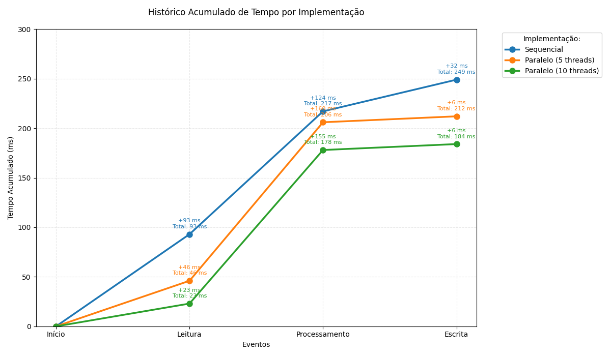

# Relatório de Desempenho na Verificação de Números Primos com Programação Paralela

## 1. Introdução

Este relatório tem como objetivo apresentar uma análise de desempenho de três implementações distintas para a verificação de números primos em um arquivo de entrada. As implementações foram desenvolvidas em Java e incluem:

- Uma implementação sequencial utilizando uma única thread;
- Uma implementação paralela utilizando 5 threads;
- Uma implementação paralela utilizando 10 threads.

A análise compara o tempo total de execução de cada abordagem para avaliar os ganhos de desempenho obtidos com a paralelização.

## 2. Estratégia de Implementação

### 2.1 Implementação Sequencial
A implementação sequencial utiliza uma única thread para percorrer a lista de números lidos do arquivo de entrada e verificar se cada um é primo. A verificação é feita por meio de uma função auxiliar que aplica uma divisibilidade otimizada.

### 2.2 Implementação Paralela com 5 Threads
Na abordagem paralela com 5 threads, um objeto compartilhado distribui os números para verificação entre as threads. Cada thread obtém um número, verifica se é primo e, se for, adiciona-o à lista de resultados.

### 2.3 Implementação Paralela com 10 Threads
A versão com 10 threads segue a mesma abordagem da versão com 5 threads, mas agora com um maior número de threads concorrentes, permitindo uma distribuição ainda mais fragmentada dos números a serem analisados.

## 3. Resultados e Análise de Desempenho

Os testes foram executados sobre um arquivo contendo 50.000 números aleatórios. A seguir, apresentamos os tempos de execução para cada abordagem:

| Implementação           | Tempo Total | Tempo de Leitura | Tempo de Processamento | Tempo de Escrita |
|-------------------------|-------------|------------------|------------------------|------------------|
| Sequencial             | 249 ms      | 93 ms           | 124 ms                 | 32 ms           |
| Paralelo (5 threads)   | 212 ms      | 46 ms           | 160 ms                 | 6 ms            |
| Paralelo (10 threads)  | 184 ms      | 23 ms           | 155 ms                 | 6 ms            |

### 3.1 Discussão dos Resultados
A implementação sequencial teve um tempo total de 249 ms. Ao utilizar 5 threads, houve uma redução de 37 ms, resultando em um tempo total de 212 ms. Com 10 threads, a redução foi ainda maior, chegando a um tempo total de 184 ms, o que representa uma economia de 65 ms em relação à abordagem sequencial.

## 4. Conclusão

Este estudo demonstrou que a utilização de paralelismo pode reduzir significativamente o tempo total necessário para verificar grandes quantidades de números primos. A implementação com 10 threads apresentou o melhor desempenho geral, reduzindo o tempo total de execução em relação à versão sequencial.

No entanto, **depois de diversos testes em sequência**, o aumento do tempo de processamento nas abordagens paralelas indica que há um custo associado à criação e sincronização de threads. Isso mostra que, apesar de o paralelismo trazer benefícios, é necessário um balanceamento adequado da carga de trabalho para obter a melhor eficiência.
